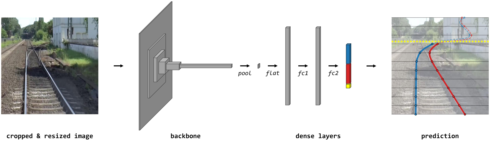

# Train Ego-Path Detection on Railway Tracks Using End-to-End Deep Learning

PyTorch implementation, dataset and trained models associated with the paper [Train Ego-Path Detection on Railway Tracks Using End-to-End Deep Learning](https://arxiv.org/abs/2403.13094).



This repository contains the code for the training and the inference of TEP-Net, an end-to-end deep learning framework designed for detecting a train's immediate path, or “ego-path”, using images from a single forward-facing camera. The model can be used seamlessly with classification, regression and segmentation prediction heads, with various EfficientNet and ResNet backbones versions and supports both PyTorch and TensorRT inference runtimes. Additionally, ego-path annotations for the RailSem19 dataset and trained model weights are available for download.

## Demo

| Demo video (1:34) | Full ride video (28:13) |
| :---------------: | :---------------------: |
| [](https://www.youtube.com/watch?v=5JD53mbepZ4) | [](https://www.youtube.com/watch?v=-a3uFIIHtnw) |

## Installation

Clone the repository and move to the project directory.

```bash
git clone https://github.com/irtrailenium/train-ego-path-detection.git
cd train-ego-path-detection
```

Install the required packages. Note: Some packages are not required for basic usage, refer to the comments within the `requirements.txt` file for more information.

```bash
pip install -r requirements.txt
```

In order to use TensorRT for compilation and inference, follow the instructions in the [NVIDIA TensorRT Installation Guide](https://docs.nvidia.com/deeplearning/tensorrt/install-guide/index.html).

## Training data and trained model weights

### Training images

The training images are sourced from the [RailSem19](https://www.wilddash.cc/railsem19) dataset. Download and extract the `rs19_val.zip` file to your preferred location. The images are located in the `rs19_val/jpgs/rs19_val` directory. Adjust the `images_path` of the global configuration file `configs/training/global.yaml` accordingly.

### Ego-path annotations and trained model weights

The ego-path annotations and trained model weights are available for [download](https://tasv.railenium.eu/egopath.zip). Their use is governed by the [CC BY-NC-SA 4.0](https://creativecommons.org/licenses/by-nc-sa/4.0/) license, in alignment with the RailSem19 dataset policy. After downloading, extract the `egopath.zip` file.

The annotations are located in the `egopath/rs19_egopath.json` file, which should be moved to your preferred location. Adjust the `annotations_path` of the global configuration file `configs/training/global.yaml` accordingly.

The trained model weights are located in the `egopath/weights` directory, which has to be moved to the project's root directory. The weights are provided for the classification, regression and segmentation methods with the EfficientNet-B3 (most accurate) and ResNet-18 (fastest) backbones. Training configurations, logs and results are available on [Weights & Biases](https://wandb.ai/greattommy/train-ego-path-detection).

The performance of these models, further detailed in the paper, is as follows:

| Name | Backbone | Method | Latency PyTorch / TensorRT * | IoU |
| ---- | :------: | :----: | :------------------------: | :-: |
| fortuitous-goat-12 | EfficientNet-B3 | Classification | 14.94 / 2.19 ms | 0.9673 |
| chromatic-laughter-5 | EfficientNet-B3 | Regression | 14.90 / 2.08 ms | 0.9753 |
| twinkling-rocket-21 | EfficientNet-B3 | Segmentation | 16.25 / 2.83 ms | 0.9769 |
| fortuitous-pig-8 | ResNet-18 | Classification | 2.33 / 0.69 ms | 0.9629 |
| logical-tree-1 | ResNet-18 | Regression | 2.30 / 0.60 ms | 0.9695 |
| brilliant-horse-15 | ResNet-18 | Segmentation | 4.89 / 1.37 ms | 0.9737 |

\* *Latency measured on NVIDIA Quadro RTX 6000 GPU with PyTorch v2.2.1 and TensorRT v8.6.1 (CUDA v12.1)*

## Getting started

### Basic usage

`demo.py` showcases the basic usage of the TEP-Net model. To get started, ensure you have the necessary model weights by following the instructions in [Ego-path annotations and trained model weights](#ego-path-annotations-and-trained-model-weights). This script gives examples of the different ways to use the `Detector` class to perform inference on a local image with PyTorch. TensorRT inference example is disabled by default, but can be enabled by uncommenting the line 22 in the `demo.py` file.

```bash
python demo.py
```

### Training

`train.py` trains the model with the specified method and backbone.

```bash
python train.py     regression  # method to use for the prediction head ('classification', 'regression' or 'segmentation')
                    resnet18  # backbone to use ('resnetx' with x in [18, 34, 50] or 'efficientnet-bx' with x in [0, 1, 2, 3])
                    --device cuda  # device to use ('cpu', 'cuda', 'cuda:x' or 'mps')
```

Training configurations are defined in the `configs` directory. The file `configs/global.yaml` sets the overall training configuration (path to the data, resolutions, augmentations, splits, etc.). Additionally, method-specific configuration files, like `configs/regression.yaml`, set the method-specific parameters (training hyperparameters, architecture configuration, etc.).

Each training run creates a new directory in the `weights` directory, named using the Weights & Biases run name. It contains the trained model weights (`best.pt`) and the configuration used during training (`config.yaml`).

### Inference

`detect.py` runs inference on images and videos using the specified trained model weights.

```bash
python detect.py    chromatic-laughter-5  # name of the trained model to use
                    egopath.mp4  # path to the input file (image or video)
                    --output output  # path to the destination directory for the output file
                    --crop 580,270,1369,1079  # coordinates to use for cropping the input image or video ('auto' for automatic cropping, 'x_left,y_top,x_right,y_bottom' inclusive absolute coordinates for manual cropping, or 'none' to disable cropping)
                    --start 10  # inference starting point in the input video in seconds
                    --end 70 # inference ending point in the input video in seconds
                    --show-crop  # displays the crop boundaries in the visual output
                    --device cuda  # device to use ('cpu', 'cuda', 'cuda:x' or 'mps')
```

### Evaluation

`eval.py` evaluates the performance (IoU and latency) of the trained models present in the `weights` directory on the test set.

```bash
python eval.py
``` 

## Acknowledgement

This research work contributes to the French collaborative project TASV (Autonomous Passenger Service Train), involving SNCF, Alstom Crespin, Thales, Bosch, and SpirOps. It was conducted in the framework of IRT Railenium, Valenciennes, France, and therefore was granted public funds within the scope of the French program “Investissements d’Avenir”.

## Citation

If you find this work useful, please cite the following paper:

```bibtex
@misc{laurent2024train,
      title={Train Ego-Path Detection on Railway Tracks Using End-to-End Deep Learning}, 
      author={Thomas Laurent},
      year={2024},
      eprint={2403.13094},
      archivePrefix={arXiv},
      primaryClass={cs.CV}
}
```

## License

This code is licensed under the MIT License. See the [LICENSE](LICENSE) file for details.